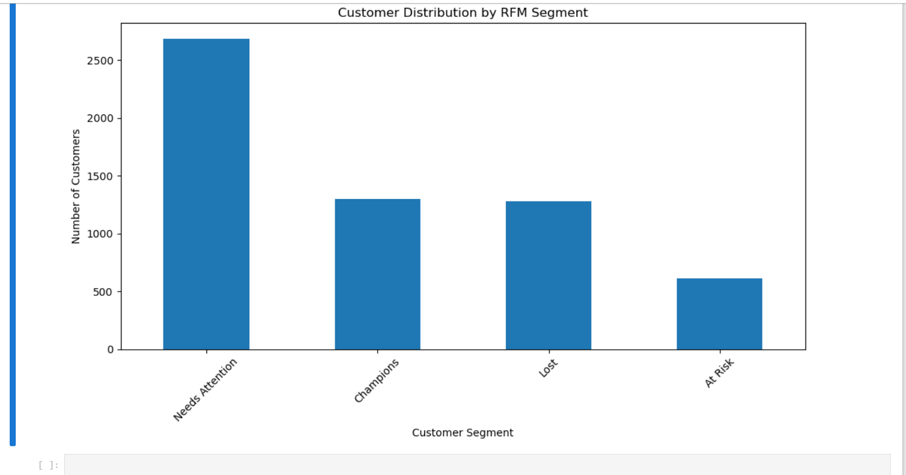

#  Retail E-Commerce Customer Segmentation & RFM Analysis

##  Project Overview

This project analyzes retail e-commerce transaction data to understand customer purchasing behaviour, identify valuable customers, and detect customers who may be at risk of churn.

The analysis uses **RFM (Recency, Frequency, Monetary) analysis** to segment customers into meaningful groups and provide actionable business recommendations.

---

## Business Objective

The main business question is:

> **Which customers are most valuable, and which customers are at risk of churning?**

The analysis aims to:

- Identify high-value customers
- Understand customer purchasing behaviour
- Segment customers based on RFM scores
- Identify customers at risk of churn
- Identify lost customers
- Compare customer segments by revenue
- Provide data-driven recommendations for customer retention and growth

---

##  Dataset

The project uses the **Online Retail II** transaction dataset.

The original dataset contains over **1 million transaction records** covering retail purchases between **2009 and 2011**.

Key fields include:

- Invoice
- Stock Code
- Product Description
- Quantity
- Invoice Date
- Price
- Customer ID
- Country

---

##  Data Cleaning & Preparation

The data preparation process included:

- Checking the dataset structure and data types
- Checking for duplicate records
- Identifying cancelled invoices
- Identifying negative quantities representing returns
- Checking missing Customer IDs
- Converting `InvoiceDate` to datetime format
- Validating the transaction date range
- Removing duplicate transactions
- Removing cancelled invoices
- Removing negative-quantity transactions
- Preparing the dataset for customer-level analysis

The original dataset contained **1,067,371 transactions** before cleaning.

---

## Business Metrics

A new `TotalSpend` metric was created:

```python
TotalSpend = Quantity × Price
```

## RFM Analysis
RFM analysis was used to evaluate customers based on three dimensions:
Recency
Measures how recently a customer made a purchase.
Lower recency = more recent purchase.
Frequency
Measures how frequently a customer placed orders.
Higher frequency = more active customer.
Monetary
Measures the total amount spent by a customer.
Higher monetary value = higher customer value.

## RFM Scoring
Customers were scored from 1 to 5 for each RFM dimension.
Recency: 5 = most recent customers
Frequency: 5 = most frequent customers
Monetary: 5 = highest-spending customers
The three scores were combined to create an overall RFM score.

 ## Customer Segmentation
Customers were classified into four business segments:
Segment
Customers
Percentage
Needs Attention
2,687
45.69%
Champions
1,297
22.05%
Lost
1,281
21.78%
At Risk
616
10.47%
Total
5,881
100%
Champions
Customers with strong recency, frequency, and monetary scores.
These are the most valuable and engaged customers.
Needs Attention
Customers who require additional engagement to increase their loyalty and purchasing activity.
At Risk
Customers who previously demonstrated purchasing value but have not purchased recently.
Lost
Customers with low recency, frequency, and monetary scores who are likely to have disengaged.

## Customer Value Analysis
The analysis identified significant differences in revenue contribution across customer segments.
Segment
Total Revenue
Average Spend
Champions
£11.86M
£9,143.86
Needs Attention
£3.69M
£1,371.90
At Risk
£1.51M
£2,444.23
Lost
£0.32M
£252.36
Champions generated the largest share of customer revenue, making them the most valuable customer segment.

## At-Risk Customer Analysis
The At Risk segment contains:
616 customers
Average Recency: 359.51 days
Average Frequency: 5.62 orders
Average Monetary Value: £2,444.23
Total Monetary Value: £1.51M
This segment represents an important retention opportunity because these customers have demonstrated purchasing value but have not purchased recently.

## Lost Customer Analysis
The Lost segment contains:
1,281 customers
Average Recency: 467.65 days
Average Frequency: 1.19 orders
Average Monetary Value: £252.36
Total Monetary Value: £323K
These customers show very low engagement and purchasing activity.

## Key Visualizations
Customer Distribution by RFM Segment




Revenue by Customer Segment
total-revenue-by-customer-segment.png

Frequency vs Monetary Value
frequency-vs-monetary-value.png

Percentage of Customers by RFM 
percentage-of-customers-by-rfm-segment.png

## Power BI Dashboard

The Power BI dashboard provides an interactive view of customer segmentation, revenue contribution, RFM metrics, and customer-level details.

Dashboard Highlights
Total Customers: 5,881
Total Revenue: £17.37M
Average Customer Spend: £2.95K
Customer distribution by RFM segment
Revenue by customer segment
Frequency vs Monetary analysis
Customer-level RFM details
Segment filtering
Recency filtering

## Key Findings

Champions are the most valuable customers, generating approximately £11.86M in revenue.
Needs Attention is the largest customer segment, representing 45.69% of customers.
At Risk customers represent a significant retention opportunity, with approximately £1.51M in total customer value.
Lost customers have the lowest average frequency and monetary value.
Customer frequency and monetary value show that highly active customers can contribute substantially more revenue.
RFM segmentation provides a practical way to prioritize customer retention and marketing activities.

## Business Recommendations

1. Retain Champions
Reward Champions through:
Loyalty programs
Exclusive offers
Early access to products
Personalized promotions
2. Re-engage At Risk Customers
Launch targeted retention campaigns using:
Personalized discounts
Limited-time offers
Product recommendations
Email reminders
3. Convert Needs Attention Customers
Encourage these customers to increase purchase frequency through:
Cross-selling
Product recommendations
Bundled offers
Loyalty incentives
4. Develop a Strategy for Lost Customers
Test low-cost win-back campaigns for selected Lost customers while avoiding excessive marketing spend on low-value customers.
5. Use RFM Segmentation for Marketing
Use customer segments to personalize campaigns rather than applying the same marketing strategy to every customer.

## Analysis Workflow
```Raw Transaction Data
        ↓
Exploratory Data Analysis
        ↓
Data Cleaning
        ↓
Feature Engineering
        ↓
Customer-Level Aggregation
        ↓
RFM Calculation
        ↓
RFM Scoring
        ↓
Customer Segmentation
        ↓
Visualization
        ↓
Business Insights
        ↓
Recommendations
        ↓
Power BI Dashboard
```

## Tools & Technologies
Python
Pandas
NumPy
Matplotlib
Seaborn
Jupyter Notebook
Power BI
RFM Analysis
Data Cleaning
Exploratory Data Analysis
Customer Segmentation
Data Visualization
Business Analytics

## Project Files
File
Description
Retails sales analysis.ipynb
Python notebook containing the complete analysis
rfm-retail-ecommerce-dashboard.png
Power BI dashboard preview
customer_rfm.csv
Customer RFM analysis output
RFM_Customer_Segmentation.csv
Final RFM customer segmentation dataset

## Skills Demonstrated
Data Cleaning
Exploratory Data Analysis
Python Data Analysis
Customer Segmentation
RFM Analysis
Feature Engineering
Business Metrics
Data Visualization
Power BI Dashboard Development
Customer Retention Analysis
Business Insight Generation
Data-Driven Recommendations

## Conclusion
This project demonstrates how raw retail transaction data can be transformed into actionable customer intelligence using Python, RFM analysis, and Power BI.
By identifying Champions, Needs Attention, At Risk, and Lost customers, businesses can prioritize retention efforts, personalize marketing strategies, and focus resources on customers with the greatest potential value.

## Author
Damilola Adejumo

Data Analyst | Python | SQL | Power BI | Excel
